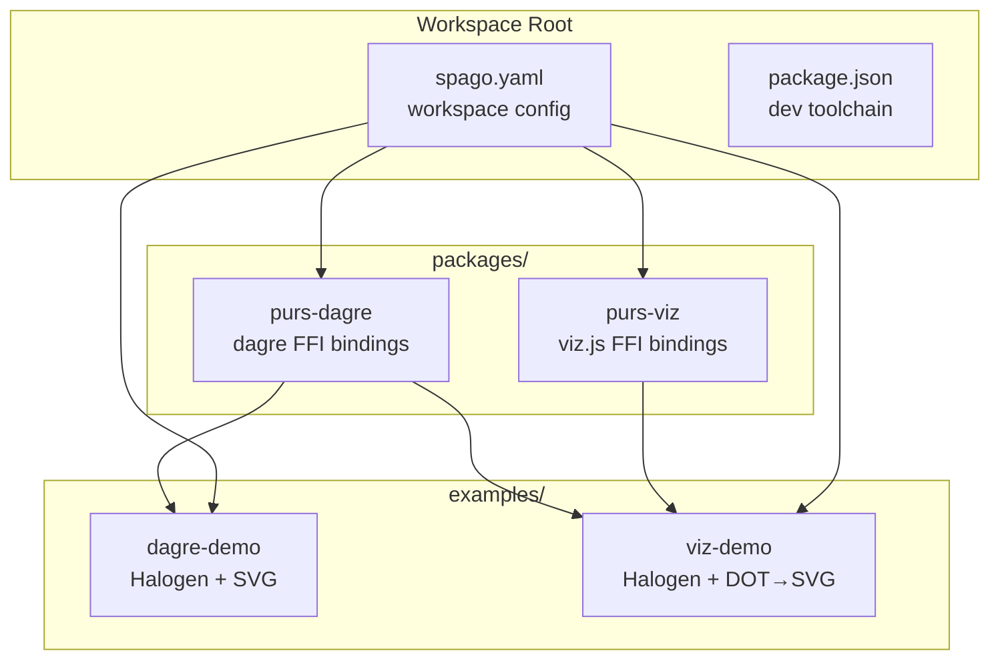
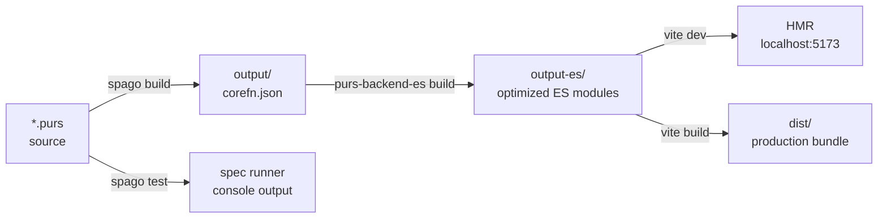
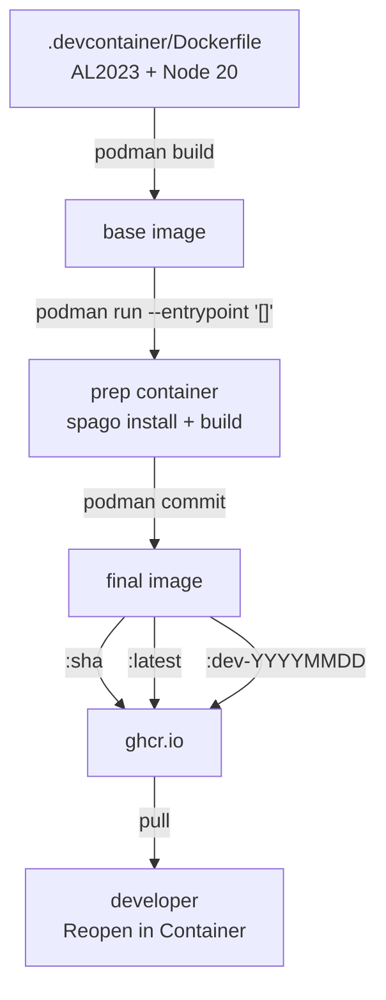
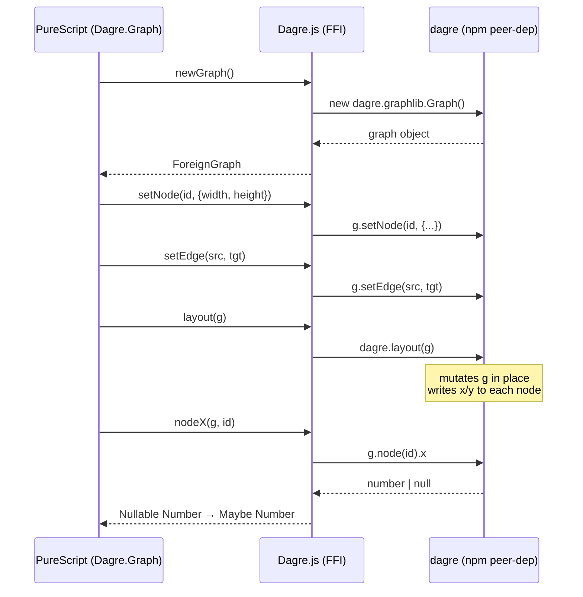
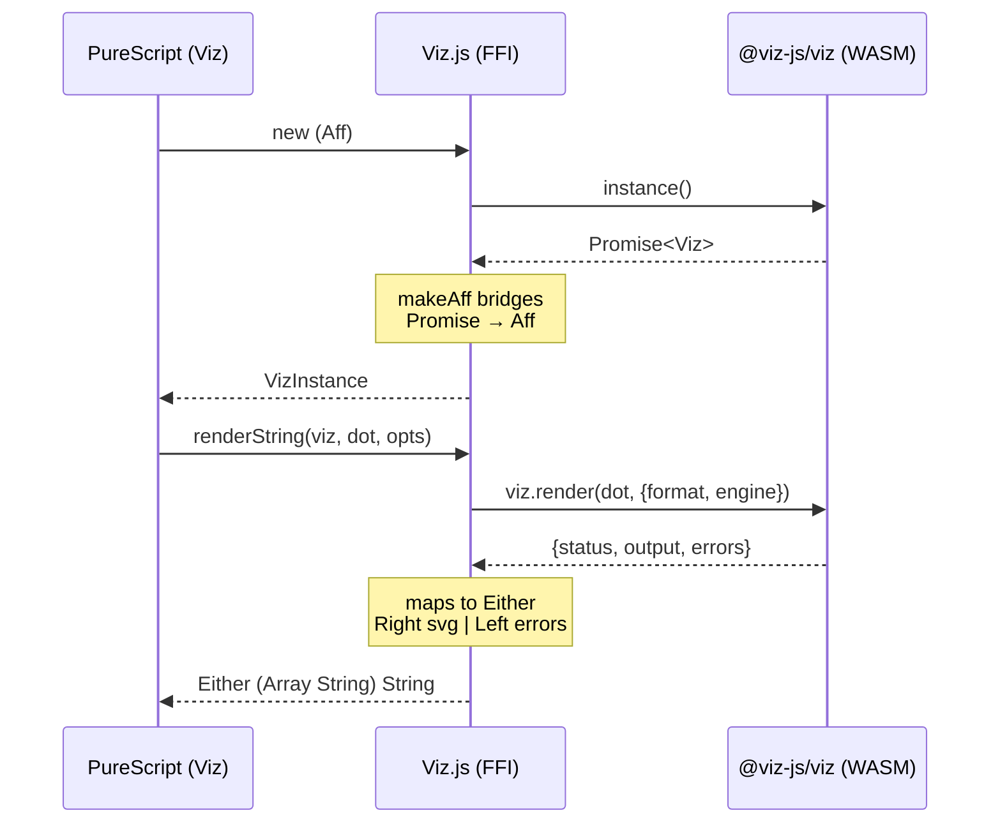
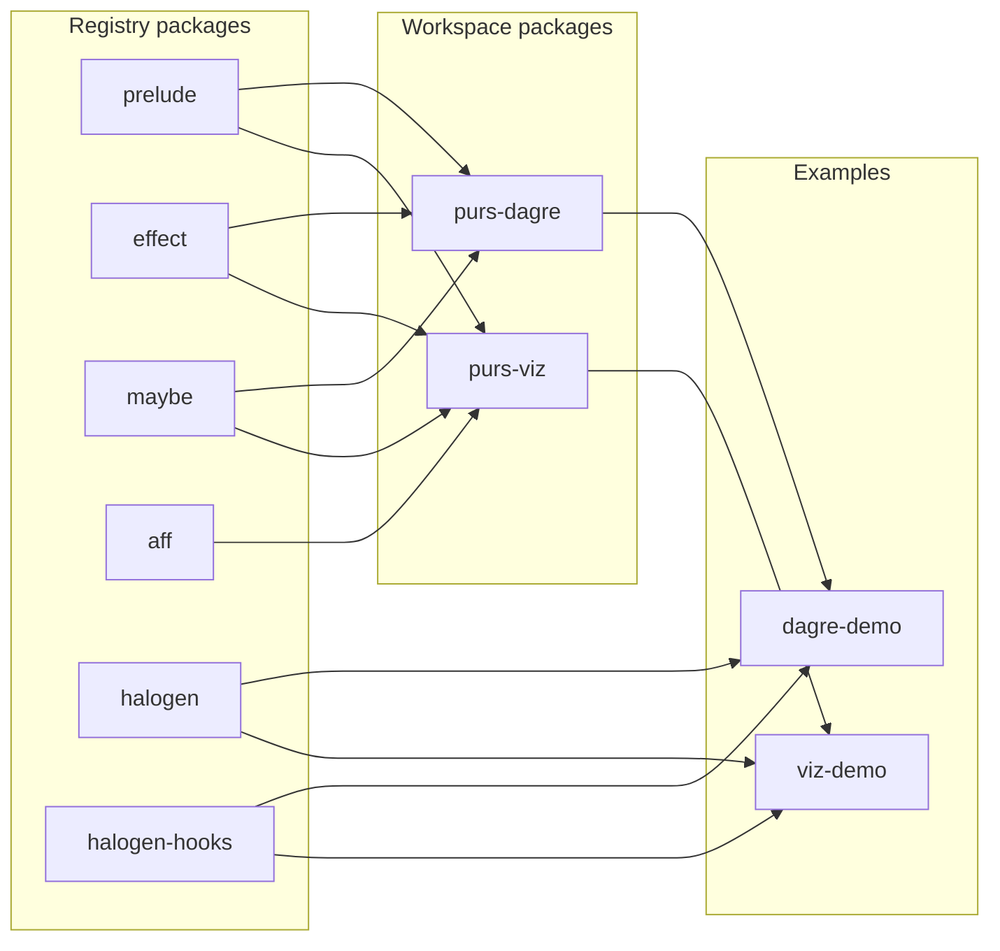

# Architecture

This document describes the build pipeline, devcontainer image workflow, and the
FFI bindings data flow for purs-graphs.

## Overview

purs-graphs is a PureScript monorepo providing two FFI binding packages and two
Halogen example apps, built on a prebuilt-devcontainer workflow.

## Build Pipeline

The workspace uses spago 0.93+ with YAML config and `purs-backend-es` as the
alternate backend. PureScript compiles to corefn, then the ES backend emits
optimized ES modules that Vite bundles for HMR.

- **`spago build`** — compiles all `.purs` files in the workspace (all packages
  + examples) via the PureScript compiler. Produces `output/` with `corefn.json`
  per module.
- **`purs-backend-es build`** — reads `corefn.json` from `output/`, emits
  optimized ES module output to `output-es/`. Configured via
  `workspace.backend.cmd` in the root `spago.yaml`.
- **`spago test --config <pkg>/spago.yaml`** — runs a single package's test
  suite. Tests use the `spec` library with `consoleReporter`.
- **Vite dev** — `concurrently -k "spago build --watch" "vite"` watches `.purs`
  files (spago) and serves the example via Vite. The JS entry
  (`src/index.js`) imports `Main` from `output-es/Main/index.js`. Vite's HMR
  triggers via `import.meta.hot.accept` when spago rebuilds.

## DevContainer Image Workflow

The devcontainer uses a **prebuilt image** pattern: the Dockerfile installs the
full PureScript toolchain (spago, purs, purs-backend-es, vite, esbuild), and CI
bakes a warm dependency cache into a published image. Teammates pull instead of
rebuilding.

- **`devcontainer.json`** has BOTH `"image"` (default — fast pull) AND `"build"`
  (explicit rebuild from Dockerfile). No `postCreateCommand` — everything is
  baked in.
- **`scripts/build-devcontainer.sh`** — builds the Dockerfile, runs
  `spago install && spago build` inside a prep container (using
  `podman run --entrypoint '[]'` to clear the Lambda base's ENTRYPOINT), commits
  the container state, tags with sha + latest + date, pushes to ghcr.io.
- **`scripts/push-devcontainer.sh`** — commits a *running* container (known-good
  state) and pushes 3 tags.
- **`scripts/save-devcontainer-tarball.sh`** — exports to `.tar.gz` + `.sha256`
  for airgap distribution.
- **CI** (`.github/workflows/devcontainer.yml`) — triggers on
  `.devcontainer/**`, `packages/**`, `examples/**`, and weekly cron for
  security refresh. Logs into ghcr.io *before* the build script (which pushes
  during the run).

## Bindings Data Flow

### purs-dagre (synchronous layout)

dagre is a pure-JS synchronous layout engine. The FFI creates a mutable
`graphlib.Graph`, the layout algorithm mutates it in place, and PureScript reads
back coordinates.

### purs-viz (async Graphviz rendering)

viz.js is a WebAssembly build of Graphviz. Instance creation is async (WASM
instantiation); rendering is synchronous. The FFI uses `Aff` + `makeAff` to
bridge the Promise, and wraps `viz.render()` (which never throws) to return
`Either` — no exceptions cross the FFI boundary.

## Workspace Package Graph

## Key Design Decisions

| Decision | Rationale |
|---|---|
| spago 0.93+ YAML (not Dhall) | New spago uses YAML workspace configs with registry-based package sets |
| `purs-backend-es` as backend | Produces optimized ES modules; smaller + faster than the default JS backend |
| npm peer-deps for JS libs | dagre + @viz-js/viz are NOT bundled in the PureScript packages; consumers install them so they can dedupe |
| `Effect` for sync FFI, `Aff` for async | dagre layout is synchronous (Effect); viz.js instance creation is async (Aff via WASM) |
| `Maybe`/`Either` for FFI returns | No exceptions cross the FFI boundary — nullable returns use `Nullable` → `toMaybe`, error returns use `Either` |
| Newtypes around foreign types | `newtype Graph = Graph ForeignGraph` provides type safety without runtime cost |
| Prebuilt devcontainer image | Fast team onboarding (pull vs rebuild); AL2023 + Node 20 base matches Lambda handoff pattern |
| Three-tag image publishing | `:sha` (immutable), `:latest` (mutable), `:dev-YYYYMMDD` (date-stamped for rollbacks) |
